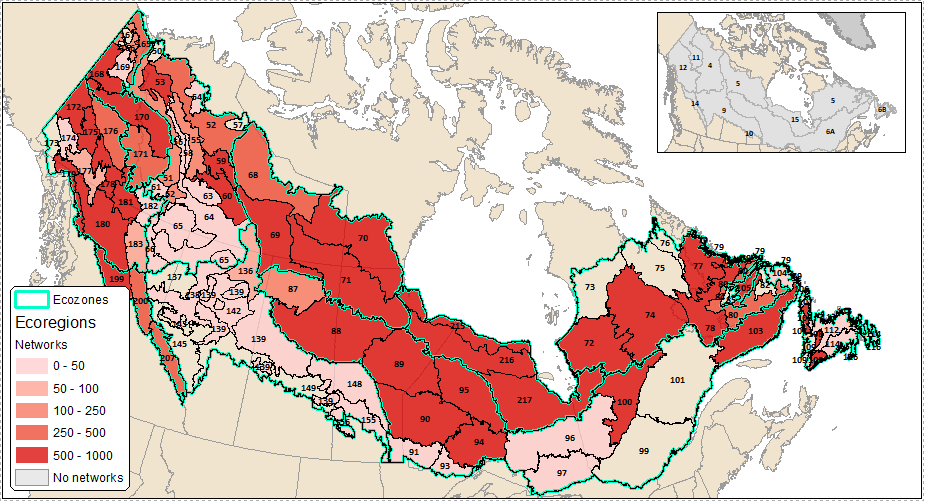

### Effectiveness of Biodiversity Surrogates in the Boreal Region of Canada

This Shiny app was developed as a companion to the manuscript "Evaluating the Effectiveness of Biodiversity Surrogates for Conservation Planning in the Boreal Region of Canada" by Vernier et al. (in prep). In the study we develop 662 multiple linear regression models between test species and environmental surrogates in 48 ecoregions across the boreal region. Due to the large amount of resultant output, we developed a Shiny app to enable readers and conservation planners in the boreal region to explore the results of the analysis and identify species and ecoregion combinations that are adequately or inadequately represented by benchmark networks selected using surrogates of large-scale environmental variation. The next section shows the study region along with the number of networks used. Subsequent sections provide a brief descrition of each tab.

#### Study area

The study was conducted in boreal region of Canada and was stratified into ecoregions (black outlines) using the National Ecological Framework for Canada (Marshall et al. 1999). The number of networks meeting size and intactness criteria by ecoregion are indicated by the value in the centre of the polygon as well as the shading of the polygon i.e., increasing shades of grey indicates higher number of networks. The inset map displays forested ecozones of the boreal region: Taiga Plains (4), Taiga Shield (5), Boreal Shield A (6A), Boreal Shield B (6B), Boreal Plains (9), Taiga Cordillera (11), Boreal Cordillera (12), Montane Cordillera (14), Hudson Plains (15).

 

#### Regression analysis

The **Regression analysis** tab provides results for all regression models developed for the test species selected from the dropdown box on the left. The table indicates ecoregion-level intactness, number of networks used, surrogate coefficient values along with t-statistics in brackets, adjusted R2 values, and root mean square errors (RMSE).

 

#### Map output

The **Map output** provides a visual look at the distribution of adjusted R2 values (i.e., model strength) across the ecoregions of the boreal region of Canada.

 

#### Observed vs predicted

The **Observed vs predicted** tab plots the relationship between observed KS values and predicted (fitted) KS values. A good model would be characterized by an upward linear relationship and show a clear separation between representative (teal) vs non-representative (red) networks.

 

#### Ecozone boxplots

The **Ecozone boxplots** tab uses bloxplots to show the distribution of ecoregion-level adjusted R2 values within ecozones.

 

#### Surrogates boxplots

The **Surrogates boxplots** tab uses boxplots to show the distribution of ecoregion-level surrogate coefficients within ecozones.

 

#### Definitions

**Adjusted R2.** The adjusted R2 summarizes how much of the total variance of the target outcome (e.g., KS for ALLBIRDS) is explained by the model (e.g., KS_CMI + KS_GPP + KS_LED + BC_LCC). The higher the adjusted R2 value, the better the model explains the data.

**RMSE.** The root mean squared error (RMSE) is a measure of uncertainty around the regression line.

**Coefficients: CMI, GPP, LED, LCC.** An increase in surrogate X by one unit (KS or BC) increases the prediction for test species Y by z KS units (z = coefficient value) when all other variable values remain fixed. For example, for the CAWA model in ecoregion 51, an increase of one unit of CMI increases predicted KS of CAWA by 0.439 units.

**Variable importance: CMI, GPP, LED, LCC.** The importance of a variable in a linear regression model is measured by the absolute value of its t-statistic i.e., the estimated coefficient divided by its standard error. The greater the variance in the estimated coefficient the less certain we are about the correct value and, consequently, the less important the variable is. Importance is indicated in the brackets under the CMI, GPP, LED, and LCC columns of the **Regression analsysi** tab.
