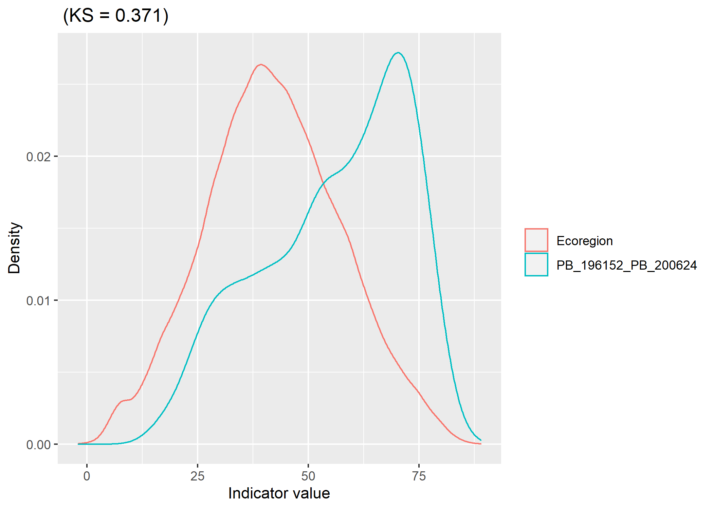
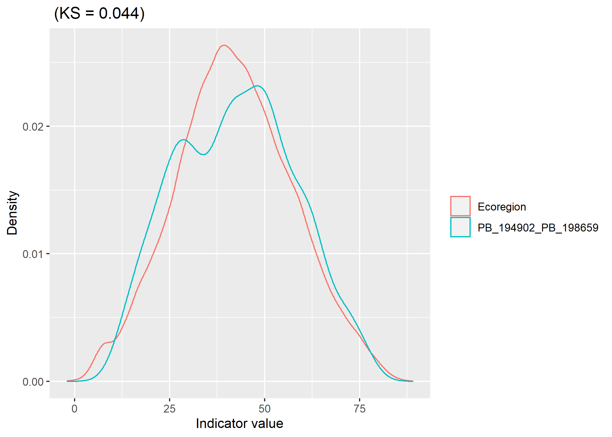

<br>

# Introduction

The surrogates manuscript defines networks as representative if they meet two representation evaluations: the MDR-based target method and the dissimilarity method.

## Dissimilarity method

The dissimilarity method uses the KS-statistic (for continuous variables) or the Bray-Curtis statistic (for categorical variables) to compare the distribution of a surrogate in a reserve network against its distribution in the ecoregion in which it occurs. KS values of 0.2 or less are considered to be representative. This method works well if the goal is for the distribution of the surrogate to be similar to its distribution in the ecoregion. However, over-representation of a surrogate is penalised with increasing dissimilarity values. For example, the distribution of specific class of a surrogate (e.g., conifer forest) in a network might match its distribution in an ecoregion quite well, but have a large amount of that specific feature type. The dissimilarity value in this scenario will be high due to the over-representation of conifer forest.

Pros:

* Simple to calculate and communicate
* Easy to rank networks relative to each other
* Good when goal is to match the ecoregion distribution

Cons:

* 0.2 cutoff is somewhat arbitrary
* Penalises networks for over-representing features

<br>

## MDR target method

The MDR-based target method sets a target for each class in a classified map of the surrogate being represented. The target proportions of each class are relative to the proportions that occur in the ecoregion and should sum to the MDR value of ecoregion i.e., the reserve size required to maintain ecological processes under the regional fire regime. Rare classes covering less than 5% of the ecoregion are dropped because they are difficult to meet. The area of each class in the reserve network is tested against its target. In order for a target to be met it must occur fully in at least one benchmark in the network. This maximises the chance that the class is maintained over time under the regional fire regime. In order for a network to pass a target, at least one reserve in the network must meet the target. **In the manuscript we used a 90% threshold to meet a target, here for demonstration purposes we require the full target to be met.** 

Pros:

* Takes the regional fire regime into account
* Does not penalise for over-representation of abundant classes
* Considers each protected area in the network separately when assessing targets

Cons:

* Networks with distributions matching the ecoregion do not necessarily pass targets (see Network 2)

---

# Illustration

Here we demonstrate the strengths and weaknesses of each of these methods as a justification for using both methods together when selecting representative networks in the manuscript. We examine two constrasting networks for their ability to represent climate moisture index (CMI). The dissimilarity approach uses a continuous map of CMI, whereas the MDR target approach uses a classified version of the CMI map.

<br>

```{r setup, include=FALSE}
knitr::opts_chunk$set(echo = TRUE)

library(raster)
library(kableExtra)
source("R/ksPlot.R")
```


```{r, include=FALSE}
# Open CMI map
cmi_eco <- raster("eco170/cmi_eco.tif")
cmi_fda <- raster("eco170/cmi_fda.tif")

# Get network polygon
nets <- shapefile("eco170/eco_170_networks_i80_t100_pb2_pas0.shp")
net1_shp <- nets[nets$netName=="PB_196152_PB_200624",]
net2_shp <- nets[nets$netName=="PB_194902_PB_198659",]
benchmarks <- shapefile("eco170/eco_170_benchmarks.shp")

# classify cmi map
brks <- c(seq(-20,100,5),1000)
cmi_class <- cut(cmi_fda, brks)

# get targets
targets <- read.csv("eco170/eco_170_target_cmi.csv")

# get area of each class in each benchmark making up the networks. 
net1 <- targets
for(pb in c("PB_196152", "PB_200624")){
  benchmark <- benchmarks[benchmarks$pb == pb,]
  pa_cmi <- mask(cmi_class, benchmark)
  pa_cmi_df <- as.data.frame(freq(pa_cmi))
  pa_cmi_df <- pa_cmi_df[!is.na(pa_cmi_df$value),]
  net1[[pb]] <- 0
  for(c in pa_cmi_df$value){
    net1[[pb]][net1$class == c] <- pa_cmi_df$count[pa_cmi_df$value == c]
  }
}
net1$pass <- 0
for(class in net1$class){
  if(max(net1$PB_196152[net1$class == class], net1$PB_200624[net1$class == class]) >= net1$target_km2[net1$class == class]){
    net1$pass[net1$class == class] <- 1
  }
}
net1 <- net1[net1$bnd_prop>0.05,]
row.names(net1) <- NULL
net1 <- net1[c("class", "range", "target_km2", "PB_196152", "PB_200624", "pass")]
names(net1) <- c("CMI class", "CMI value range", "Target (km2)", "PB_196152 (km2)", "PB_200624 (km2)", "Target passed")

net2 <- targets
for(pb in c("PB_194902", "PB_198659")){
  benchmark <- benchmarks[benchmarks$pb == pb,]
  pa_cmi <- mask(cmi_class, benchmark)
  pa_cmi_df <- as.data.frame(freq(pa_cmi))
  pa_cmi_df <- pa_cmi_df[!is.na(pa_cmi_df$value),]
  net2[[pb]] <- 0
  for(c in pa_cmi_df$value){
    net2[[pb]][net2$class == c] <- pa_cmi_df$count[pa_cmi_df$value == c]
  }
}
net2$pass <- 0
for(class in net2$class){
  if(max(net2$PB_194902[net2$class == class], net2$PB_198659[net2$class == class]) >= net2$target_km2[net2$class == class]){
    net2$pass[net2$class == class] <- 1
  }
}
net2 <- net2[net2$bnd_prop>0.05,]
row.names(net2) <- NULL
net2 <- net2[c("class", "range", "target_km2", "PB_194902", "PB_198659", "pass")]
names(net2) <- c("CMI class", "CMI value range", "Target (km2)", "PB_194902 (km2)", "PB_198659 (km2)", "Target passed")
```

## Network 1: Passes targets, poor dissimilarity

First we consider a network that passes all of the MDR-based targets, but has a relatively high KS-statistic when compared to the ecoregion. When this network is compared as a whole to the CMI distribution across the ecoregion, the KS value is relatively high at 0.371. This is because the higher CMI values in the more southern protected area (PB_200624) skew the distribution. This can be seen in the density plot below.

When testing for the MDR-based targets, protected area PB_196152 (the more northern reserve in the map below) has a CMI distribution that closely matches the ecoregion and it actually passes all the MDR-based targets alone, as shown in the table below. The second protected area, PB_200624, has a greater proportion of high CMI values and passes the targets for the two highest CMI classes. In the results table, the 'Target passed' column indicates if the network as a whole, meets the target (i.e. does at least one of the two reserves pass the target in full?). All CMI targets are passed by this network.

In this case the network meets all of the MDR-based targets for CMI, but it over-represents high CMI values. This might be fine for some conservation planning exercises, but in the present study we want to limit the representative networks to those that have a relatively close match to the ecoregions distribution of CMI.

```{r, echo=FALSE, warning=FALSE, fig.width=10,fig.height=8}
plot(cmi_eco, main = "Network 1 - CMI (cm/year)")
plot(net1_shp, add=TRUE)
```

```{r, echo=FALSE, warning=FALSE}
#print net1 table
net1 %>% kbl() %>% kable_styling()
```


```{r, echo=FALSE, warning=FALSE, message=FALSE, include=FALSE}
reference_vals <- values(cmi_eco)
target_vals <- values(mask(cmi_fda, net1_shp))
ksPlot(reference_vals, target_vals, plotTitle = "", saveAs = "eco170/PB_196152_PB_200624.png", regLab="Ecoregion", netLab="PB_196152_PB_200624")
```
<center>

</center>

## Network 2: Fails targets, good dissimilarity

The second network we consider is also made up of two protected areas. In contrast to Network 1, this network has a very good dissimilarity value of 0.044. This suggests that when taken as a whole, the network has a relatively similar distribution of CMI compared to the ecoregion. This can be seen in the density plot below where the two lines track much closer than in Network 1.

Despite having similar density curve to the ecoregion, Network 2 fails two of the nine MDR-based targets for CMI. This can be seen in the table below where neither of the individual protected areas meet the target for classes 8 or 9. The reason the targets need to be met in full by one of the protected areas in the network is to ensure the representation of the class is resilient to the fire regime. In Network 2, there is a risk that concurrant fires in both protected areas could elimiate all available habitat occupying CMI classes 8 and 9. All other classes, in meeting the targets, should maintain habitat in that class even under an active fire regime (**It's important to note that especially with rarer classes, it is still possible that a fire could impact all of a class even in a reserve that passes all the targets. However a network that passes the targets is more likely to maintain all classes on the landscape than one that doesn't. The only way to ensure all classes are maintained over time would be for all class targets to be equal to the largest fire size. This would impossible to achieve in most cases. The MDR-based target approach is therefore a compromise that maximises the chance of maintaining all classes over time.**).

While Network 2 may be considered representative of the ecoregion based on its distribution of CMI (and a KS-value <0.2), we do not consider it to be resilient to the regional fire regime based on the results of the MDR-based representation analysis.

```{r, echo=FALSE, warning=FALSE, fig.width=10,fig.height=8}
plot(cmi_eco, main = "Network 2 - CMI (cm/year)")
plot(net2_shp, add=TRUE)
```

```{r, echo=FALSE, warning=FALSE}
#print net2 table
net2 %>% kbl() %>% kable_styling()
```

```{r, echo=FALSE, warning=FALSE, message=FALSE, include=FALSE}
reference_vals <- values(cmi_eco)
target_vals <- values(mask(cmi_fda, net2_shp))
ksPlot(reference_vals, target_vals, plotTitle = "", saveAs = "eco170/PB_194902_PB_198659.png", regLab="Ecoregion", netLab="PB_194902_PB_198659")
```
<center>

</center>
